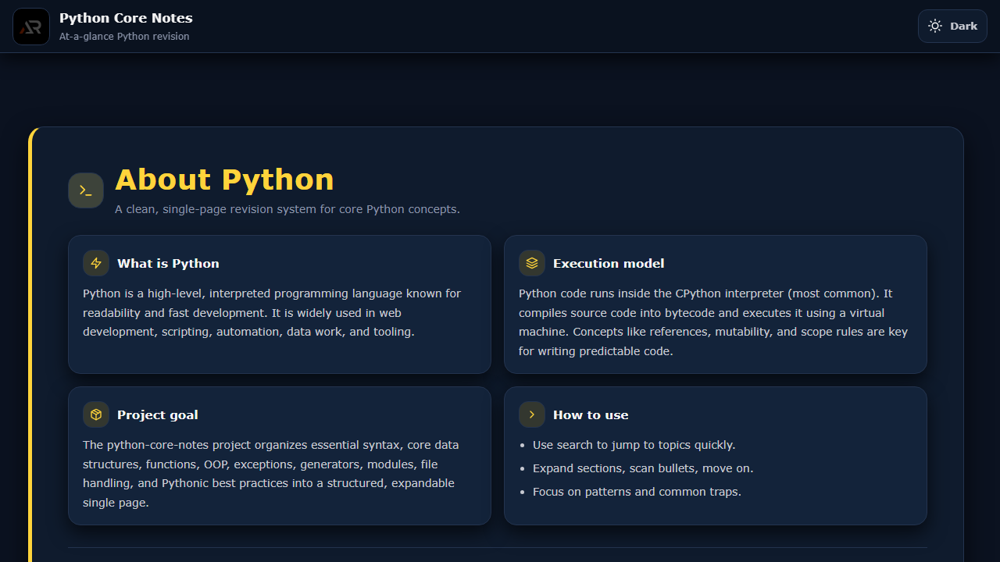

# Python Core Notes

A focused single-page React revision guide for Python syntax, data structures, functions, OOP, async programming, testing, and practical best practices.



## Features

- Topic-based notes with collapsible examples and explanations.
- Fixed branded header with Python theme tokens and light/dark mode.
- Independent content scrolling with stable scrollbar space.
- Responsive layout with a floating scroll-to-top control.
- Icon-only social and support links in the footer.

## Tech stack

React, Vite, styled-components, react-icons, and CSS custom properties.

## Run locally

```bash
npm install
npm run dev
```

Validate, build, and deploy:

```bash
npm run lint
npm run build
npm run deploy
```

Live URL: [a2rp.github.io/python-core-notes](https://a2rp.github.io/python-core-notes/)

## Links

- [Portfolio](https://www.ashishranjan.net/)
- [GitHub](https://github.com/a2rp)
- [CodePen](https://codepen.io/ash1198)
- [LinkedIn](https://www.linkedin.com/in/aashishranjan)
- [Facebook](https://www.facebook.com/theash.ashish/)
- [YouTube](https://www.youtube.com/@ashishranjan-ashz?sub_confirmation=1)

## Support

- [Support](https://a2rp-donation-page.netlify.app/)
- [Buy Me a Coffee](https://buymeacoffee.com/a2rp)
- [Patreon](https://patreon.com/a2rp)

## License

MIT License. See [LICENSE](LICENSE).
