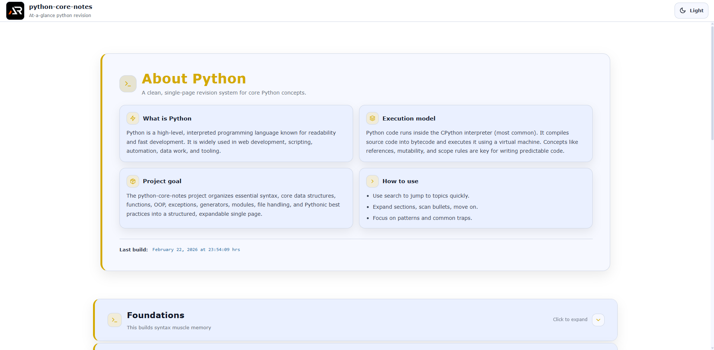

# Python Core Notes

A single-page, at-a-glance revision project for core Python concepts.

This project is designed as a fast reference and structured summary sheet covering essential Python topics without unnecessary depth.  
It focuses on clarity, execution model, real-world usage, and modern Python fundamentals.

---



---

## Purpose

- Quick revision before interviews
- Rapid recall of core Python concepts
- Clear mental model of execution flow, memory references, and runtime behavior
- Practical, production-focused reminders
- Strong foundation in data structures, functions, OOP, and Pythonic best practices without overload

## Coverage

- Python basics and syntax
- Variables, data types, and type conversion
- Operators and control flow
- Functions and parameter patterns (args, kwargs, defaults)
- Scope rules and closures basics
- Strings and formatting (f-strings)
- Lists, tuples, sets, and dictionaries (core methods and patterns)
- Comprehensions (list, dict, set) and generator expressions
- Iteration model (iterators, iter, next)
- Generators and yield
- Error handling (try/except/else/finally, raise, custom exceptions)
- Modules, imports, and packages
- Virtual environments basics (venv, pip)
- File handling (read/write, with context manager)
- JSON basics (serialize/deserialize)
- OOP fundamentals (class, object, inheritance, polymorphism)
- Dunder methods (repr, str, len, iter)
- Dataclasses basics
- Mutability vs immutability
- Copying (shallow vs deep)
- References and memory model basics
- Functional tools (map, filter, lambda)
- Sorting (sorted, key, reverse)
- Regex basics
- Date and time basics (datetime)
- HTTP basics (requests-style usage concepts)
- Async basics (async/await overview)
- Common interview traps and best practices

## Tech Stack

- React
- Vite
- styled-components

## Project Type

Single page only  
Section-based navigation  
Searchable and expandable content  
No blog-style content, only structured notes

Each topic is modular and collapsible for fast scanning.

## Run Locally

```bash
npm install
npm run dev
```

## Goal

Complete core Python knowledge in one scrollable page.
No fluff. No repetition. Just essentials.

## Links

- Portfolio: [https://www.ashishranjan.net](https://www.ashishranjan.net)
- GitHub: [https://github.com/a2rp](https://github.com/a2rp)
- CodePen: [https://codepen.io/ash1198](https://codepen.io/ash1198)
- LinkedIn: [https://www.linkedin.com/in/aashishranjan](https://www.linkedin.com/in/aashishranjan)
- Facebook: [https://www.facebook.com/theash.ashish/](https://www.facebook.com/theash.ashish/)
- YouTube: [https://www.youtube.com/@ashishranjan-ashz?sub_confirmation=1](https://www.youtube.com/@ashishranjan-ashz?sub_confirmation=1)
- Email: [ash.ranjan09@gmail.com](mailto:ash.ranjan09@gmail.com)

## Support

- Support: [https://a2rp-donation-page.netlify.app/](https://a2rp-donation-page.netlify.app/)
- Buy Me A Coffee: [https://buymeacoffee.com/a2rp](https://buymeacoffee.com/a2rp)
- Patreon: [https://patreon.com/a2rp](https://patreon.com/a2rp)
<!-- Project links -->

## Links

- Live: [https://a2rp.github.io/python-core-notes/](https://a2rp.github.io/python-core-notes/)
- Repository: [https://github.com/a2rp/python-core-notes](https://github.com/a2rp/python-core-notes)
- Portfolio: [https://www.ashishranjan.net/](https://www.ashishranjan.net/)
- GitHub: [https://github.com/a2rp](https://github.com/a2rp)
- CodePen: [https://codepen.io/ash1198](https://codepen.io/ash1198)
- LinkedIn: [https://www.linkedin.com/in/aashishranjan](https://www.linkedin.com/in/aashishranjan)
- Facebook: [https://www.facebook.com/theash.ashish/](https://www.facebook.com/theash.ashish/)
- YouTube: [https://www.youtube.com/@ashishranjan-ashz?sub_confirmation=1](https://www.youtube.com/@ashishranjan-ashz?sub_confirmation=1)
- Email: [ash.ranjan09@gmail.com](mailto:ash.ranjan09@gmail.com)

## Support

- Support: [https://a2rp-donation-page.netlify.app/](https://a2rp-donation-page.netlify.app/)
- Buy Me a Coffee: [https://buymeacoffee.com/a2rp](https://buymeacoffee.com/a2rp)
- Patreon: [https://www.patreon.com/a2rp](https://www.patreon.com/a2rp)
